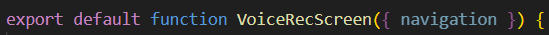
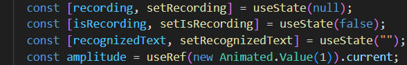
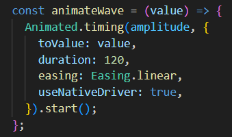
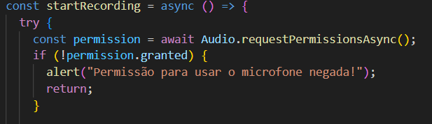
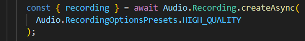
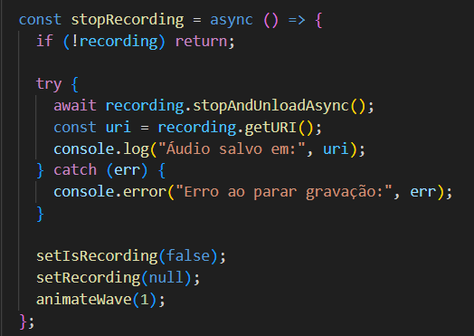
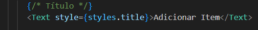
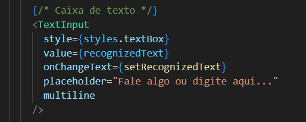
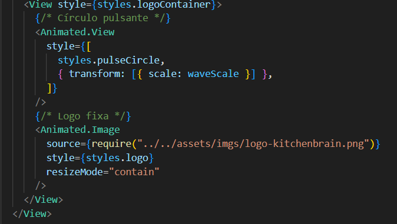
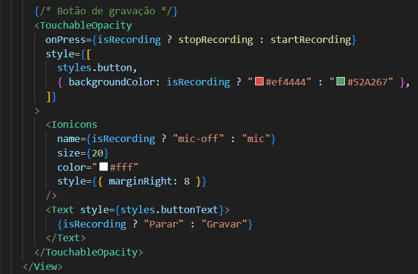

# kitchen_brain

uvicorn app.main:app --reload

Documentação ConfigsScreen.jsx

Visão Geral


O ConfigsScreen é um componente de tela que exibe uma lista de opções de configuração (como "Perfil", "Notificações", "Sobre", etc.). Cada item da lista é clicável e exibe um ícone, um título e uma seta indicativa. A lista é renderizada de forma eficiente utilizando o componente FlatList.

Funcionalidades Principais

    Exibe um título claro no topo da tela.

    Renderiza uma lista vertical de opções de configuração.

    Cada item da lista possui um ícone, um título e uma seta para a direita.

    Utiliza TouchableOpacity para fornecer feedback visual ao pressionar um item.

    Exibe um separador visual entre cada item da lista.

    Registra no console qual item foi pressionado (funcionalidade de navegação a ser implementada).

Dependências

Para funcionar corretamente, o componente importa os seguintes pacotes e componentes:


    React Native:

        View: Contêiner principal para layout.

        Text: Para exibição de textos.

        TouchableOpacity: Componente de botão com feedback de opacidade.

        StyleSheet: Para criar e organizar os estilos.

        FlatList: Para renderizar listas longas com performance.

    @expo/vector-icons:

        Ionicons: Biblioteca de ícones utilizada para o ícone de cada item e a seta.

Estrutura do Componente

O componente é organizado da seguinte forma:


    View (container): O contêiner raiz que envolve toda a tela.

    Text (header): O título principal da tela, "Configurações".

    FlatList: O elemento central que renderiza a lista. Ele é configurado com:

        data: O array settings que contém os dados da lista.

        renderItem: A função que define a aparência de cada item.

        keyExtractor: Uma função que extrai o id de cada item como chave única.

        ItemSeparatorComponent: Renderiza um componente View para criar a linha separadora.

Função renderItem

A função renderItem é responsável por renderizar cada linha da FlatList. A estrutura de cada item é:


    TouchableOpacity (item): Invólucro que torna a linha inteira clicável.

        Ionicons (icon): Exibe o ícone (item.icon) à esquerda.

        Text (title): Exibe o título (item.title) no centro, ocupando o espaço restante.

        Ionicons (chevron): Exibe uma seta (chevron-forward) fixa à direita.

Props

Estrutura de Dados

O componente utiliza um array de objetos estático chamado settings para alimentar a FlatList. Cada objeto no array deve seguir a seguinte estrutura:


Estilização (StyleSheet)

Os estilos do componente estão centralizados em um objeto StyleSheet para melhor organização e performance.


    container: Estilo do contêiner principal. Define o flex, backgroundColor e padding.

    header: Estilo do título da tela. Define fontSize, fontWeight e marginBottom.

    item: Estilo para cada linha da lista. Usa flexDirection: 'row' e alignItems: 'center' para alinhar ícone e texto.

    icon: Estilo para o ícone, definindo a marginRight.

    title: Estilo para o texto do item. Usa flex: 1 para que o texto ocupe todo o espaço disponível entre o ícone e a seta.

    separator: Estilo da linha fina que separa os itens da lista.

////////////////////////////////////////////////////////////////////////

Documentação VoiceRecScreen.jsx

O código implementa uma tela de gravação de voz no React Native (com Expo).
Ele grava áudio via expo-av, exibe uma animação pulsante que simula o volume da fala, e gera palavras aleatórias para simular uma transcrição.

Início do componente



Cria a tela principal. Recebe ```navigation``` se quiser trocar de telas.

Estados


```
recording: guarda o objeto da gravação.

isRecording: indica se está gravando ou não.

recognizedText: texto que aparece na caixa (simulação da fala).

amplitude: controla o tamanho do círculo animado (1 = normal).
```
Função da animação



Faz o círculo “pulsar”.
A cada chamada, o valor muda de 1 pra algo tipo 1.3, e volta.
useNativeDriver: true faz a animação mais leve (roda no thread nativo).

Função para iniciar a gravação



Pede permissão pro microfone.
Se o usuário negar, mostra um alerta e sai da função.



Cria e inicia uma gravação com alta qualidade.
O objeto recording é retornado e contém o controle da gravação.

Função para parar a gravação



Quando o usuário clica em “Parar”:

Para a gravação.
Obtém o endereço (uri) do arquivo de áudio.
Reseta os estados e animação.

Interface Visual

Título



Texto no topo da tela. (Poderia ser “Gravação de Voz”.)

Caixa de texto



Mostra o texto “reconhecido”.
O usuário também pode editar manualmente.

Logo + círculo animado



Aqui rola a animação principal:

O círculo verde (pulseCircle) cresce e diminui conforme o som.
A logo fica sobreposta no centro (estática).

Botão de gravação



O botão muda de cor e ícone:

Verde com microfone quando não grava.
Vermelho com microfone cortado quando está gravando.
O clique alterna entre startRecording e stopRecording.


Documentação CardápioBotScreen

1. Importações


```
React, useState, useEffect, useRef: Hooks essenciais do React para estado, efeitos colaterais e referências.

ActivityIndicator: Spinner para mostrar carregamento.

FlatList: Lista eficiente para mensagens do chat.

KeyboardAvoidingView: Ajusta a UI quando o teclado aparece (iOS/Android).

Platform: Detecta a plataforma para comportamentos diferentes.

TextInput, TouchableOpacity, View, Text: Componentes básicos de interface.

Keyboard: Permite escutar eventos do teclado.

useHeaderHeight: Retorna a altura real do header do navigation stack (importante para offset do teclado).

Constants: Permite pegar configurações do Expo (como API_KEY).

Ionicons: Ícones da biblioteca de ícones do Expo/React Native
```
2. Constantes de configuração
```
const GEMINI_MODEL = "gemini-2.5-flash"; // modelo Gemini usado para gerar conteúdo
const API_KEY = Constants.expoConfig?.extra?.GEMINI_API_KEY; // chave da API do Gemini
```
- Define o modelo generativo e a chave de API.
```
const EMOJIS = ["😀","😁","😂","😊","😍","😋","😎","🤔","🙌","👍","👎","🥗","🍲","🍛","🍳","🥪","🍎","🥦","🧀","🥖","🍗"];
```
- Array de emojis disponíveis para o teclado emoji do chat.
```
const STARTER_BOT_MSG = {
  id: "m0",
  role: "bot",
  text: "Bom dia! Sou seu assistente de geração de cardápios! Inicie uma conversa comigo para que eu possa te auxiliar a montar o melhor cardápio possível para você!",
};
```
- Mensagem inicial do bot ao abrir a tela.

3. Estado do componente
```
const [messages, setMessages] = useState([STARTER_BOT_MSG]); // array de mensagens
const [text, setText] = useState(""); // texto do input
const [loading, setLoading] = useState(false); // indica se uma requisição está em andamento
const [showEmoji, setShowEmoji] = useState(false); // mostra ou esconde o painel de emojis
```
- messages: histórico do chat.

- text: texto digitado no input.

- loading: controla spinner e bloqueio do input enquanto o bot responde.

- showEmoji: boolean que controla a exibição do teclado emoji.

4. Refs e altura do header
```
const listRef = useRef(null); // referência para FlatList (scroll)
const inputRef = useRef(null); // referência para TextInput (focus)
const headerHeight = useHeaderHeight(); // altura real do header para offset do teclado
```
- listRef: usado para scroll automático ao enviar/receber mensagens.

- inputRef: permite focar o input programaticamente.

- headerHeight: usado no KeyboardAvoidingView para calcular offset.


CardapioBot: Seu Assistente de Planejamento Culinário

O CardapioBot é uma aplicação móvel desenvolvida em React Native que simplifica o planejamento de refeições. Ele atua como um planejador inteligente, organizando cardápios semanais ou diários completos com base nas suas necessidades, restrições e inventário de cozinha.

**Funcionalidades em Destaque**

* Planejamento Personalizado e Contextual: Gera planos de refeições altamente detalhados, considerando um conjunto abrangente de informações do usuário:
* Restrições Alimentares: Estilo dietético (`Sem lactose`, `Flexitariana`, etc.) e lista de alergias/exclusões.
* Metas Nutricionais: Atende a objetivos específicos de macronutrientes e calorias.
* Inventário de Cozinha: Prioriza o uso de itens disponíveis na despensa e produtos com vencimento próximo, otimizando o estoque e reduzindo o desperdício.
* Logística: Considera tempo máximo de preparo, equipamentos de cozinha disponíveis (Air fryer, Panela de pressão, etc.) e culinárias desejadas.
* Interface Interativa: Utiliza uma interface de chat para receber pedidos de forma conversacional e intuitiva, com atalhos para solicitações rápidas (`Batch cooking`, `Despensa primeiro`).
* Relatórios Estruturados: O resultado é um cardápio completo, apresentado em um "chip" interativo que inclui:
    Sugestões de Refeições por dia.
    Estimativas Nutricionais (Kcal, Proteína, Carboidratos, Gordura).
    Plano de *Batch Cooking* (preparos antecipados).
    Lista de Compras detalhada.
    Estimativa de Custo.
Gerador de PDF: Converte o cardápio gerado em um arquivo PDF formatado para fácil visualização, impressão e compartilhamento.
Ajustes Rápidos: Permite ao usuário solicitar alterações pontuais (ex: "Trocar o almoço de terça por sopa") e as aplica no cardápio de forma automática.
Persistência de Contexto: Mantém as preferências de planejamento e o último cardápio gerado em exibição para referência e consistência.

**Estrutura Técnica**

O CardapioBot é construído em React Native e utiliza várias bibliotecas para suas funcionalidades:

* Interface: Componentes customizados para o chat, cartões de contexto (`Section`, `InfoBadge`) e seleção de parâmetros (`Chip`).
* Navegação e Layout: Utiliza `@react-navigation/elements` para obter a altura do cabeçalho e `KeyboardAvoidingView` para uma experiência de entrada de texto fluida.
* Geração de Documentos: Implementa as bibliotecas `expo-print` e `expo-file-system` para a conversão do cardápio em HTML e sua exportação como PDF.
* Compartilhamento: Utiliza `expo-sharing` para permitir que o usuário baixe ou compartilhe o PDF do cardápio gerado.

O núcleo do aplicativo reside na coleta de dados do usuário (perfil e preferências), sua compilação em um contexto detalhado, e no processamento dessa informação para gerar o plano de refeições estruturado.

## Documentação Detalhada da Tela CardapioBotScreen (React Native)

O arquivo `CardapioBotScreen.jsx` implementa um assistente inteligente de planejamento de cardápios. A tela integra uma interface de chat com uma área de configuração de contexto que alimenta um poderoso mecanismo de geração de planos de refeição estruturados.

### 1. Constantes e Dados de Contexto (Setup Inicial)

| Linha(s) | Variável/Constante | Descrição | Importância |
| :--- | :--- | :--- | :--- |
| `L21` | `GEMINI_MODEL` | O modelo de linguagem utilizado. | Define o motor de geração de conteúdo. |
| `L32-L37` | `PROFILE_SNAPSHOT` | Dados estáticos (simulados) do perfil do usuário: nome, estilo alimentar, alergias e metas de macros. | Fundamental para personalizar o cardápio e manter as restrições de segurança. |
| `L48-L51` | `EXPIRING_ITEMS` | Lista de itens da despensa com vencimento próximo. | Prioriza o uso desses itens no algoritmo de planejamento para evitar desperdício. |
| `L55-L67` | `QUICK_PROMPTS` | Objetos para atalhos de prompt, usando *placeholders* (ex: `{range}`, `{tempo}`). | Melhora a usabilidade, permitindo que o usuário envie pedidos complexos rapidamente. |
| `L74-L359` | `MOCK_MENU_PAYLOAD`, `MOCK_MENU_RESPONSE` | JSON estruturado de um cardápio de demonstração e sua versão encapsulada em XML. | **Mecanismo de *Fallback***: usado quando a chamada à API falha ou retorna vazio, garantindo a funcionalidade de demonstração da UI. |

---

### 2. Gerenciamento de Estado e Contexto (Hooks)

| Linha(s) | Função/Estado | Descrição | Importância |
| :--- | :--- | :--- | :--- |
| `L364` | `messages` | O estado principal que armazena a conversação (mensagens do usuário, respostas do bot e o chip de cardápio). | Controla a renderização da `FlatList` e o histórico de contexto. |
| `L373-L382` | `selectedRange`, `servings`, `budget`, etc. | Variáveis de estado que controlam os *inputs* e *chips* da área de configuração (cabeçalho da lista). | Os valores desses estados compõem o contexto de planejamento enviado ao motor de geração. |
| `L383` | `lastMenuChip` | Armazena o último cardápio válido gerado, incluindo a URI do PDF. | Permite a referência e o compartilhamento do último resultado e é incluído no `requestContext` (L407) para manter a consistência. |
| `L399-L432` | `requestContext` | Hook `useMemo` que **compila todos os estados de planejamento** (perfil, metas, despensa, restrições) em um único objeto JSON. | **CRÍTICO:** Este objeto JSON é o "cérebro" da personalização, sendo enviado como contexto para o processador de planejamento. |

---

### 3. Lógica de Interação e Comunicação

| Linha(s) | Função | Descrição | Importância |
| :--- | :--- | :--- | :--- |
| `L438-L459` | `callGemini(prompt)` | Função assíncrona que envia a requisição para a API externa (através de `fetch`). | **Ponto de comunicação com o motor de planejamento.** Se falhar, o sistema usa o *fallback*. |
| `L473-L508` | `handleSend` | Processa a mensagem do usuário: adiciona a mensagem, exibe o *typing indicator*, chama `callGemini` com o prompt construído por `buildPrompt`, e trata a resposta. | O orquestrador do fluxo de chat e geração de cardápio. |
| `L941-L985` | `buildPrompt(userText, ctx)` | Monta a instrução completa para o modelo de linguagem, injetando o `userText` e o JSON de `ctx` (o `requestContext` da L399). | **Define a personalidade e as regras de planejamento** (regras de segurança, formato JSON de saída, regras de priorização). |
| `L523-L536` | `sharePdf` | Lida com o compartilhamento do PDF gerado (URI local) usando `expo-sharing`. | Funcionalidade de exportação essencial para a usabilidade. |
| `L551-L606` | `finishWithParsedMenu` | Função final que insere a resposta do bot e o componente `MenuChip` na lista de mensagens, após a geração bem-sucedida ou *fallback*. | Responsável por atualizar o `lastMenuChip` e disparar a geração do PDF. |

---

### 4. Processamento de Cardápio e PDF

| Linha(s) | Função | Descrição | Importância |
| :--- | :--- | :--- | :--- |
| `L987-L1010` | `parseMenuChip(raw)` | Analisa a resposta bruta (`raw`) do modelo, extraindo o JSON que está entre as tags `<MENU>` e `</MENU>`. | Garante que o conteúdo estruturado seja extraído do texto de conversação para ser renderizado como um componente interativo. |
| `L1019-L1031` | `generateMenuPdf(menuChip)` | Chama `buildMenuHtml` para criar o HTML, usa `Print.printToFileAsync` para gerar o PDF e move o arquivo para um diretório persistente. | Responsável por criar o artefato final (PDF) a partir da estrutura JSON do cardápio. |
| `L1042-L1070` | `applyUserOverrides` | Processa o texto do usuário para encontrar comandos simples de substituição (ex: "trocar o café da manhã por..."). | Permite que o usuário faça alterações rápidas no cardápio gerado sem ter que regenerar tudo. |
| `L1109-L1190` | `buildMenuHtml` | Gera a *string* HTML formatada com CSS para ser utilizada pelo `expo-print` (formato A4 para impressão). | Converte os dados estruturados do JSON em uma representação visual para o PDF. |

---

### 5. Componentes de UI e Estilização

| Linha(s) | Componente/Função | Descrição | Importância |
| :--- | :--- | :--- | :--- |
| `L539` | `renderItem` | Função que decide qual componente renderizar para cada item da lista (`MessageRow`, `TypingRow`, `MenuRow`). | Gerencia a diversidade de tipos de mensagens no chat. |
| `L684-L715` | `MenuPreview` | Componente visual que exibe o resumo do cardápio gerado (dias, refeições, lista de compras) dentro do chat. | **Representação central do resultado do planejamento**, permitindo interação imediata. |
| `L741-L760` | `PdfAttachment` | Componente para exibir um link de download/compartilhamento de um PDF dentro de uma bolha de mensagem. | Indica a presença do artefato de exportação. |
| `L627-L633` | `inputBar` | `View` que contém a caixa de texto e o botão de envio. | Inclui o gerenciamento de *loading* (`ActivityIndicator`) e a lógica de habilitação/desabilitação do botão de envio. |

